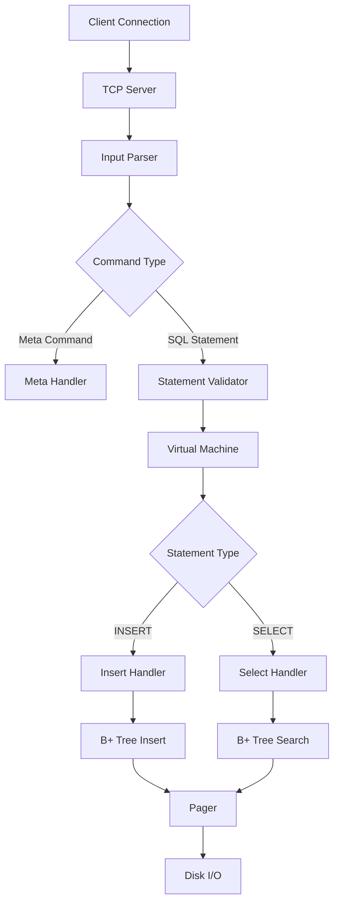

# SDB - A Lightweight SQL Database Engine

A lightweight, SQLite-inspired database engine built from scratch in C with TCP networking support and a JavaScript ORM for seamless integration.

## 🚀 Features

### Core Database Features
- **SQL-like Query Interface**: Support for INSERT and SELECT statements
- **B+ Tree Storage Engine**: Efficient indexing and data retrieval
- **ACID Properties**: Ensures data consistency and reliability
- **Page-based Storage**: Optimized memory management with 4KB pages
- **Persistent Storage**: Data persistence to disk with proper file handling
- **Meta Commands**: Built-in commands for database introspection (`.btree`, `.constants`, `.exit`)

### Networking & Connectivity
- **TCP Server**: Built-in TCP server for remote database connections
- **Multi-client Support**: Handle multiple concurrent client connections
- **Network Protocol**: Custom protocol for database operations over TCP

### Advanced Features
- **B+ Tree Implementation**: Self-balancing tree structure for optimal performance
- **Node Splitting**: Automatic handling of full nodes with splitting algorithm
- **Cursor-based Navigation**: Efficient row traversal and positioning
- **Memory Management**: Smart paging system with lazy loading
- **Error Handling**: Comprehensive error handling and validation

## 📚 SDB commands
 Meta commands for database introspection:
- `.btree`: Displays the current B+ tree structure
- `.constants`: Lists important constants used in the database
- `.exit`: Exits the database client

Query commands:
- `insert <id> <name> <email>`: Inserts a new row into the database
- `select`: Retrieves all rows from the database

## Makefile Commands
- `make`: Compiles the database engine
- `make clean`: Cleans up compiled files and executables
- `make run`: Runs the database server with a specified database file
- `make debug`: Compiles the database engine with debugging symbols

## 🛠️ Tech Stack

- **Language**: C (C99 standard)
- **Storage**: Custom page-based file format
- **Networking**: POSIX sockets (TCP/IP)
- **Data Structure**: B+ Tree for indexing
- **Build System**: GCC/Make compatible

## 🏗️ Architecture

### High-Level Architecture

```
┌─────────────────┐    ┌──────────────────┐    ┌─────────────────┐
│   Client App    │◄───┤   TCP Network    │───►│  SimpleDB       │
│  (JS ORM/CLI)   │    │    Protocol      │    │   Server        │
└─────────────────┘    └──────────────────┘    └─────────────────┘
                                                         │
                                                         ▼
                                               ┌─────────────────┐
                                               │  Query Engine   │
                                               │  - Parser       │
                                               │  - Validator    │
                                               │  - Executor     │
                                               └─────────────────┘
                                                         │
                                                         ▼
                                               ┌─────────────────┐
                                               │ Storage Engine  │
                                               │  - B+ Tree      │
                                               │  - Pager        │
                                               │  - File I/O     │
                                               └─────────────────┘
```

### Component Breakdown

#### 1. **Query Processing Pipeline**
```
SQL Input → Parser → Validator → Executor → Storage Engine → Disk
```

1. **Input Buffer**: Handles client input via TCP or stdin
2. **Parser**: Converts SQL strings to internal statement structures
3. **Validator**: Checks syntax, data types, and constraints
4. **Executor**: Processes validated statements using virtual machine approach
5. **Storage Engine**: Manages data persistence and retrieval

#### 2. **Storage Architecture**

```
Table
├── Pager (Memory Manager)
│   ├── File Descriptor
│   ├── Pages Array [0...399]
│   └── File Length
└── B+ Tree Structure
    ├── Internal Nodes (Navigation)
    └── Leaf Nodes (Data Storage)
```

**Page Structure (4KB each)**:
- **Header**: Node type, parent pointer, cell count
- **Cells**: Key-value pairs (ID + serialized row data)
- **Metadata**: Navigation pointers for tree traversal

#### 3. **Data Flow**



#### 4. **B+ Tree Implementation**

- **Internal Nodes**: Store keys and child pointers for navigation
- **Leaf Nodes**: Store actual data records with next-leaf pointers
- **Splitting Logic**: Automatic node splitting when capacity exceeded
- **Root Management**: Dynamic root creation and management


## 📊 Data Model

### Storage Layout
- **Page Size**: 4,096 bytes
- **Max Pages**: 400 (1.6GB theoretical limit)
- **Rows per Page**: ~13 rows (accounting for B+ tree overhead)
- **Max Rows**: ~5,200 rows per table

## 🔧 Installation & Usage

### Prerequisites
- GCC compiler
- POSIX-compatible system (Linux/macOS)
- Make (optional)

### Building the Database
```bash
# Clone the repository
git clone <repository-url>
cd simpledb

# Compile the database
gcc -o simpledb *.c -std=c99

# Or using make
make simpledb
```

### Running the Database
```bash
# Start the database server
./simpledb database.db 8080

# The server will listen on port 8080
# Database file 'database.db' will be created if it doesn't exist
```

### Basic Usage
```sql
-- Connect via telnet or custom client
telnet localhost 8080

-- Insert data
db > insert 1 john john@email.com
Executed.

-- Query data
db > select
(1, john, john@email.com)
Executed.

-- Meta commands
db > .btree
Tree:
- leaf (size 1)
  - 1

db > .constants
ROW_SIZE: 293
LEAF_NODE_MAX_CELLS: 13
...

db > .exit
```

## 🌐 JavaScript ORM

A lightweight ORM is provided for easy integration with Node.js applications:

### Installation

### Usage Example
```javascript
const ORM = require('./sdb');

ORM.connect(8080, '127.0.0.1');


ORM.query('select', (err, result) => {
  if (err) return console.error(err);
  console.log("Intial Data",result);
});

ORM.query('insert 2 sahil sahil@gmail.com', (err, result) => {
  if (err) return console.error(err)
    console.log("Data inserted")    
});
ORM.query('insert 3 john sahil@gmail.com', (err, result) => {
  if (err) return console.error(err)
    console.log("Data inserted")   
});


ORM.query('select', (err, result) => {
  if (err) return console.error(err);
  console.log("Final Data",result);
});
```


## 🔍 Performance Characteristics

- **Insert Performance**: O(log n) - B+ tree insertion
- **Search Performance**: O(log n) - B+ tree traversal  
- **Memory Usage**: ~4KB per page + minimal overhead
- **Concurrency**: Single-threaded with connection queuing
- **Storage Efficiency**: ~13 rows per 4KB page


## 🛣️ Roadmap

### Planned Features
- [ ] **UPDATE and DELETE statements**
- [ ] **Indexing on non-primary keys**
- [ ] **Transactions and rollback support**
- [ ] **Connection pooling**
- [ ] **Query optimization**
- [ ] **Schema definitions**
- [ ] **Multi-table support**
- [ ] **Authentication and authorization**
- [ ] **Replication and clustering**

### Performance Improvements
- [ ] **Multi-threading support**
- [ ] **Write-ahead logging (WAL)**
- [ ] **Buffer pool management**
- [ ] **Compression algorithms**
- [ ] **Query caching**


## 🙏 Acknowledgments

- Inspired by SQLite's architecture and design principles
- [Reference Article](https://cstack.github.io/db_tutorial/)
- B+ Tree implementation based on classic database system concepts
- TCP networking patterns from UNIX socket programming
